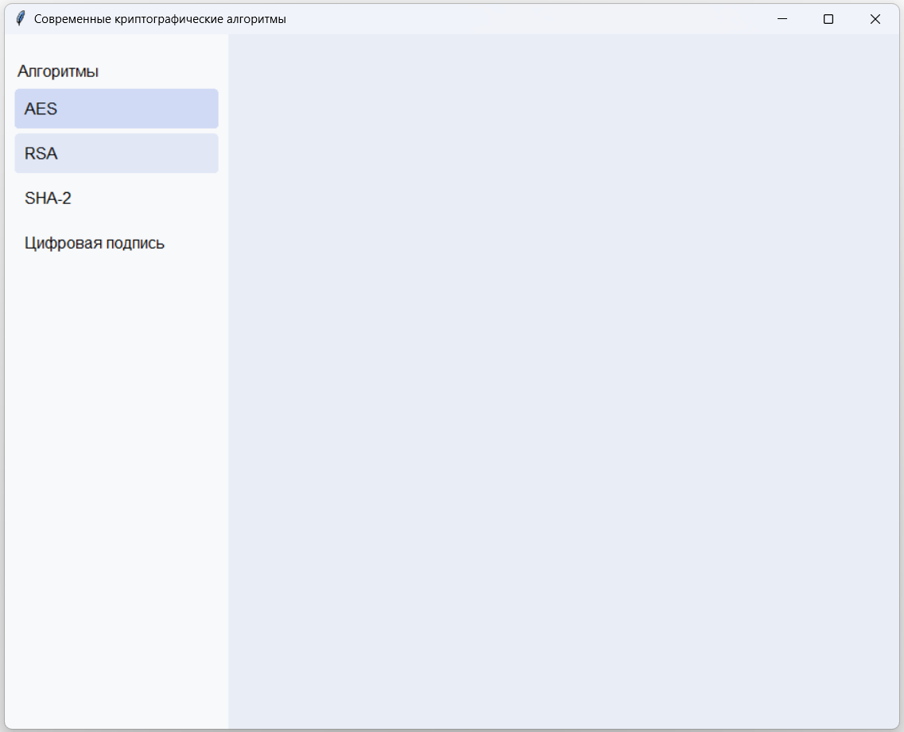

# ModernCrypto

Демонстрационное оконное приложение для исследования времени работы криптографических алгоритмов. Пользовательский интерфейс работает на Tkinter (Python), а в основе криптографии лежит CryptoPP (C++)

Пока что интерфейс содержит только пункты меню, но впоследствии будет дополнен тругими нужными компонентами

Для компиляции проекта требуется предустановленный PyInstaller и запуск compile.bat, который скомпилирует проект и запустит исполняемый файл